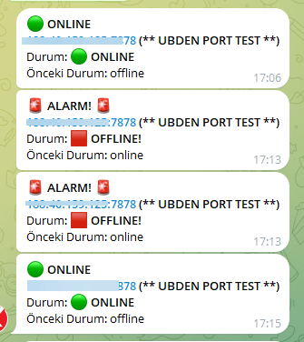

# 🚀 **New Advanced Version Available!**  

🎉 **Now on Apple Store & Google Play!** 🎉  

[](https://apps.apple.com/us/app/ucloud-monitor/id6742205340)  
[](https://play.google.com/store/apps/details?id=com.app.ucloudmonitor)


# Ping Test Tool with Telegram Notifications


An automated ping test interface that periodically pings the IPs you have added and notifies you via Telegram if there is a packet loss.

---

## Features

- **Add IPs**: Easily add the IPs you want to monitor.
- **Add Categories**: Organize your IPs into categories.
- **Real-Time Status**: View the real-time status of added IPs.
- **View Logs**: Check the latest logs for detailed results.
- **Automated Testing**: Performs tests at regular intervals based on cron jobs.
- **Telegram Notifications**: Sends alerts to a predefined Telegram number in case of any issues.

---

## Screenshots

### Dashboard View


### Notification Example


---

## Installation

### Prerequisites
- PHP 8.x
- Telegram Bot Token

### Setup

1. Clone the repository:
   ```bash
   git clone
   ```

2. Edit files:
   ```bash
   config.php
   ```


---

## Türkçe Açıklama


Telegram Bildirimli Otomatik Ping Test Arayüzü

Eklemiş olduğunuz IP adreslerini düzenli aralıklarla ping atan ve bir kayıp söz konusu olduğunda Telegram üzerinden size bildirim gönderen bir sistem.

---

### Özellikler

- **IP Ekleme**: Takip etmek istediğiniz IP'leri kolayca ekleyin.
- **Kategori Ekleme**: IP'lerinizi kategorilere göre düzenleyin.
- **Anlık Durum Görüntüleme**: Eklediğiniz IP'lerin anlık durumlarını görüntüleyin.
- **Log Görüntüleme**: Son logları detaylı bir şekilde inceleyin.
- **Otomatik Testler**: Belirlenen aralıklarla (cron görevlerine göre) testler yapar.
- **Telegram Bildirimleri**: Sorun durumunda seçili Telegram numarasına uyarılar gönderir.

---

## Ekran Görüntüleri

### Dashboard Görünümü


### Bildirim Örneği


---

## Kurulum

### Gereksinimler
- PHP 8.X
- Telegram Bot Token

### Kurulum

1. Depoyu klonlayın:
   ```bash
   git clone
   ```

2. Size Göre Düzenleyin:
   ```bash
   config.php dosyasını
   ```

---

## Bağış Yapın

Bu proje size faydalı olduysa, bizi desteklemek için [ubd.one/donate](https://ubd.one/donate) adresinden bağış yapabilirsiniz.

---

## License

This project is licensed under the MIT License - see the [LICENSE](LICENSE) file for details.

---

## Contributing

Contributions are welcome! Please open an issue or submit a pull request if you would like to contribute.

---
